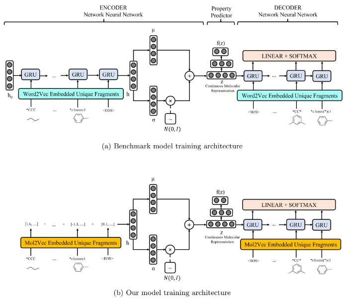

# DEFRAGMO "a DEep FRAGment-based generative model for de novo MOLecular design"
This code is based on the publicly available code by Podda et al. (2020) for the paper "A Deep Generative Model for Fragment-Based Molecule Generation" (AISTATS 2020). The original paper and the proceedings can be found through the following links: [Paper](http://proceedings.mlr.press/v108/podda20a/podda20a.pdf) - [AISTATS 2020 proceedings](http://proceedings.mlr.press/v108/)

### Getting started
To get started, follow these steps:
1. **Create a Conda Environment** and install all the packages in the `environment.yml` file using the following command:
```bash
conda env create -f environment.yml
```
This will create a conda environment called DEFRAGMO and install all the relevant packages.

2. **Set up mol2vec**  
    **Install mol2vec** by running the following code:
    ```python
    pip install git+https://github.com/samoturk/mol2vec
    ```
    **Update mol2vec's sentences2vec function** to be compatible with Gensim version 4.0.0+. Locate the location of the mol2vec library by running the following code:
    ```python
    pip show mol2vec
    ```  
    Locate the *features.py* file from the installed mol2vec library. **On line 425, change the following code**:
    ```python
    keys = set(model.wv.vocab.keys())
    ```
    ```python
    keys = set(model.wv.key_to_index.keys())
    ```

### Preprocess the dataset
To preprocess the data run the following command:

```bash
python  src/manage.py preprocess --data_name <name_of_dataset> --method <name_of_method>
```

To use our fragmentation algorithm, replace `<name_of_method>` with `DEFRAGMO`, to use the original fragmentation method replace this with `PODDA`.

### Training the model
To train the model run the following command:
```bash
python  src/manage.py train --data_name <name_of_dataset> --use_gpu --batch_size <size_of_batch> --embed_size <embedding_size> --num_epochs <number_of_epochs> --hidden_layers <number_of_hidden_layers> --hidden_size <hidden_size> --latent_size <latent_size> --pooling <pooling_method> --pred_sas --pred_logp --embed_method <method_of_embedding> --beta <kl_annealing_schedule>
```
To get the full list of hyperparameters that can be altered, `run python src/manage.py train --help`. For the embed method, the choices are **mol2vec** (default) or **skipgram** which learns embeddings using a skipgram model using word2vec. Note that if we are using mol2vec embeddings, the **embedding_size has to be 100**.

To replicate the model we trained in our paper, run the following command:
```bash
python  src/manage.py train --data_name ZINC --use_gpu --batch_size 128 --embed_size 100 --num_epochs 4 --hidden_layers 2 --hidden_size 128 --latent_size 100 --embed_method mol2vec --beta 1e-6 1e-06 1e-06 1e-06
```

#### Pooling method
The original paper did not implement a pooling method for the encoder. To leave the model training under this setting, remove `--pooling <pooling_method>` from the training command (Figure (a)). For our paper, we summed the fingerprint embeddings of each fragment. To implement this model, add `--pooling sum_fingerprints` to the training command (Figure (b)). We've also implemented mean pooling (`--pooling mean`) and max pooling (`--pooling max`) as detailed by [Long et al. (2020)](https://arxiv.org/pdf/1911.03976.pdf) to prevent posterior collapse.

### Sampling from the model
To sample from the model run the following command:
```bash
python  src/manage.py sample --run_dir src/runs/<name_of_run> --load_last --num_samples <number_of_samples> --sample_constant <constant_multiplier> --max_length <max_length> --sampler_method <method_of_sampling> --temperature <temperature>
```
1. `<name_of_run>` e.g. 2024-05-03-11-05-40-ZINC.
2. `load_last` load the last epoch of the model. Omit this argument and the epoch with the best lost will be loaded.
3. `<number_of_samples>`. Default is 1000.
4. `<constant_multiplier>` the constant to be multiplied to the sample standard deviation from the latent space. Default is 1.
4. `<max_length>` is the maximum tokens to sample. Default is 10.
5. `<method_of_sampling>` is the sampling method. Choices are greedy (default, sampling greedily from the latent space), sample_first (sample the first token from the distribution and then sampling the rest of the tokens greedily), sample_all (sampling all the tokens except for the EOS token which is greedy).
6. `<temperature>` is the sampling temperature. Default is 1.

To replicate the sampling configuration from our paper, run the following command:
```bash
python  src/manage.py sample --run_dir src/runs/<name_of_run> --num_samples 20000 --sample_constant 25
```

### Plotting the results
To reproduce the plots from our paper run the following command:
```bash
python  src/manage.py plot --run_dir src/runs/<name_of_run> --sample_name <name_of_file_containing_samples>
```

